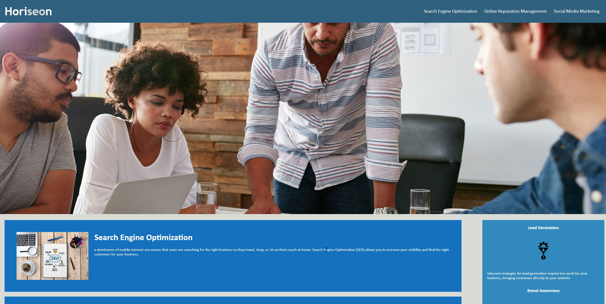

Rework:
1. To improve accessibility and ensure a better experience for users, I added all the images with good alt attributes
2. I added comments within CSS Files
3. I have enhanced README.MD

This Application has HTML and CSS files

I followed accessibility standards rules and optimized the code to be more search engines enhanced

I applied semantic html elements to HTML

I applied comments on CSS Files

I applied logical structure independent of styling and positioning

I applied the image elements with good alt elements

I applied for sequential order in heading attributes

Finally, when I view the title element, then I can find a concise, descriptive title

Live Site Link

https://sagagi74.github.io/HtmlCSSAssignment/

